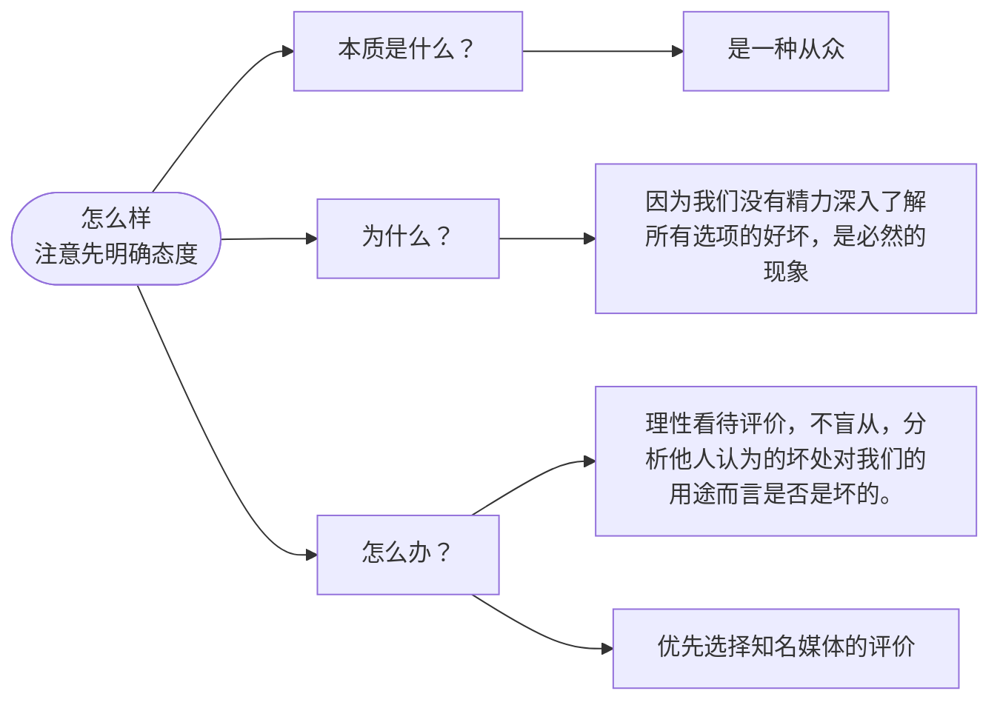
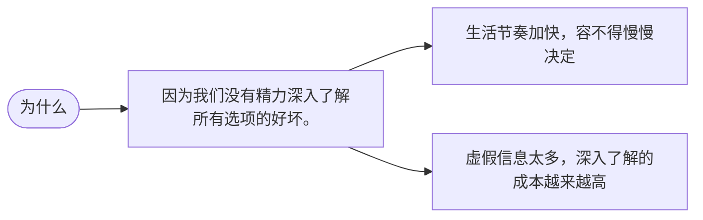
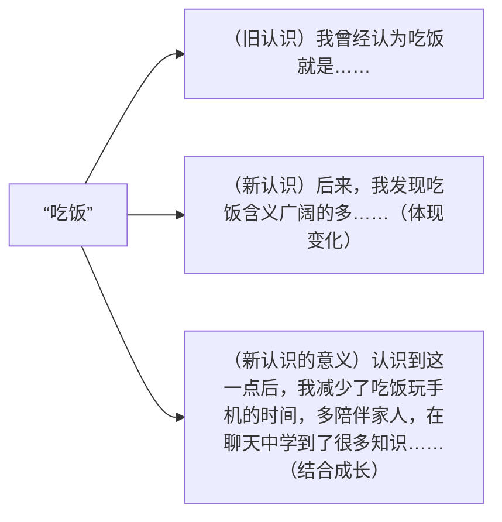

> 终点线只是一个记号而已，其实并没有什么意义，关键是这一路你是如何跑的。——村上春树

不知不觉距离上一篇post又过去了接近一年时间，高三就这么过去了，高考成绩出来了，暑假也过去一大半了。

是时候再写一点了，为了纪念我在一中度过的3年时光，也为了留下经验，给未来的自己，也给需要的人。

请注意，以下是我个人的总结，我成绩也不算很好，难免有错误或缺漏，请理性看待。本人是2026届广东物化地考生，选考英语，本文成文于公历2026年秋季，内容或有过时。下文有不少内容来自上课的笔记。

## 语文

很高兴能在一中遇上一批好老师。在此表示感谢。

回到正题，我语文算是各科里面最差的了，常年90-100pts浮动，所以能写的也很有限。

书写字体：按常识评判，能看清，也能让AI看清基本上不会扣分。

### 古文

注意到我并不想把本文变成超长的一页笔记本，所以只是指出大致方向。

首先是要了解中国古代文化，包括古人的生活方式、政治制度、文化传统、文言文中的各种意象。然后嘛，题做多了就有感觉了。

### 作文

作文还是以议论文为主，记叙文也能拿高分但是文笔要特别特别好。

可以写小标题或者副标题，但是不要写题记，除非你专门学过怎么写，不然大概率只会扣分。

#### 题目分析

首先注意材料关键字，尤其是重复出现的词语，还有限定词和写作任务，比如今年全国一卷作文题：

> 词语是表达思想情感的载体，也是展现社会生活变化的窗口。当前，世界之变、时代之变、历史之变正以前所未有的方式展开。青年是常为新的，在你的成长过程中，你对哪一个词语的理解发生了变化？这变化有你成长的印记，对你有特殊的意义……
> 
> 以上材料引发了你怎样的联想和思考？请写一篇文章。
> 
> 要求：选准角度，确定立意……

这里的关键词有“词语”、“思想情感的载体”、“社会变化的窗口”、“世界、时代、历史”、“青年”、“成长过程”、“理解的变化”、“对你的印记和意义”。（不过近几年有材料变短的趋势，重复词语可能会比较少，这就要看自己把握重点的能力了）

然后明确写作要求、写作任务、方向。要求就是不少于800字、诗歌除外那些，一般都差不多。身份是青年，一般都是青年、学生之类的，有些演讲稿可能会有“你是学生代表”之类的。

写作任务是“引发了你怎样的联想和思考”、“请写一篇文章”。这里题目如果有提出问题，文章一定要回答问题，比如“你对**哪一个**词语的理解发生了**变化**？”，那文章内容一定要回答这个问题，提到**一个具体的词语**，一定是一个；还有你的理解的变化，既然是变化，就要展现出前后分别是什么；至于变化的原因，他没明确问，那就可选，可以考虑一笔带过（实际上我今年就没写原因，直接略过了，因为实在编不出合适的原因来）。

然后要写的是“联想和思考”，表明要我们对这个词语的内涵深入思考和分析。也就是说，不能写“我曾以为吃饭只是吃饭，后面发现还包括吃菜”，改变有了但是思考在哪里？思维在评分标准里面通常占20分。你可以写“我曾以为吃饭只是吃东西，后面随着对中华文化了解的深入，才明白‘民以食为天’反映的不只是生理需求，也是对吃饭的重视，才明白吃饭连接了古代的政治和商业，也用年夜饭、团圆宴联系着在外打工的家人、在外游历的游子。”从单纯的“吃”上升到了“吃饭”的深层内涵、价值、在中华文化中的地位，这才叫联想和思考。（我高考写的不是“吃饭”是“坚持”）

思维非常重要，即使文笔不出众，思考深刻、立意独到、论证有力，也能拿到50多分，但要提升文笔而又没有天赋，我只能说很难，搞不好还会有辞藻堆砌、华而无实之嫌。

题目给出了方向：“这变化有你成长的印记，对你有特殊的意义……”，那就按照题目的方向来写，即结合自己的成长和时代。（虽然我今年作文在这方面做得不是很好）

如果没有明确的方向那就自选方向，比如2024年上海卷作文：

> 生活中，人们常用认可度判别事物，区分高下。请写一篇文章，谈谈你对“认可度”的认识和思考。

自选方向可以是“用认可度判别事物，怎么样？”或者“你怎么看待？”

#### 立意

既然是议论文，就要有中心论点和分论点，分论点一般写3个，4个也行，一般一个分论点一段，题目一般直接表明中心论点就是了。

比如认可度这题，“怎么样”可以展开

这个“是什么”、“为什么”、“怎么办”有点万金油，非常好用，强烈推荐记下来。

（本文提到的“是什么”这些问句是便于理解，作文里的论点一般是陈述句或反问句，“用认可度判别事物，本质上是一种从众行为”这叫论点）

需要注意几点：

1. **明确态度**：如果题目没有评价好坏（隐含的价值评价也算，比如“xxx给我们的生活带来了哪些好处？”，既然是好处，那题目肯定认为是好的），在**第一段**就要明确你的态度，是好 or 不好、对 or 错、是 or 否。（有时候你的题目或论点态度够鲜明了可以不写，但还是建议写）只能选一个态度，*不能骑墙*，左右摇摆，既要又要，一会说这是好的，一会说这是不好的。如果题目说了好还是坏，不要和题目对着干。给几个例子：“中国近年重视农业发展，有人质疑我们应该全面转向高附加值的高端产业，你怎么看？”这种算没评价，“有人”不是命题人；“有人说xxx、也有人说xxx”，也算没给评价；“文创产品爆火，*却*有人指责无用”，注意这个“却”，表示转折同时隐含负面情感，说明命题人其实认为文创并非无用，算给了评价，但这种没有很明确说明“xx是好的”或者出现了两种观点的，即使题目明确了观点，最好也在第一段强调一遍。

2. **注意区分骑墙和辨证**：例如“AI是好的，能帮助我们提高效率；AI是不好的，会返回错误的信息误导用户。”这叫骑墙，到底好还是不好？态度模糊，会扣分，3字头，写的比较好的可能有4字头。再如，中心论点“合理利用AI，让技术服务于人”，分论点“AI是好的，能帮助我们提高效率；不可否认，AI有其缺点，例如会出现幻觉，给出错误信息；我们应当合理利用AI，不盲目相信AI的回应，提高媒介素养，可以让AI成为工具而非绊脚石。”总体而言明确地认为AI是好的，但仍承认其并非完美，这叫辨证，是加分项。

3. **一级展开**：我高一的语文老师教我立意要“一级展开”，例如上面“怎么样”延伸到“是什么、为什么、怎么办”三个角度是一级展开。但如果题目加一句“为什么我们偏爱这种方法”再把思路变成下面这样

那就是错误的，因为“节奏加快”和“虚假信息太多”是“无法深入了解”的原因而非“偏爱用认可度判别事物”的直接原因，是二级展开。（除非再不动笔就收卷了20分好过零分的情况）至少至少，再加一两点直接原因，比如“认可度更高的路线容易获得投资等支持”，和“没有精力”平行，这才叫一级展开。

让我们回到2026年“词语”一题，假如我们选择的词语是“吃饭”，我们可以这样：

（你可以做不到，但改卷老师又不管你真假，不要太假就是了）

上面是总分的立意方式，比较常用的还有一种渐进式。比如：

这里中心论点一般是最后一段的论点，题目反映中心论点，可以写“拒绝盲目相信，让AI成为工具”。

你可以考虑先写一句话，然后再尝试拆分成多个句子，变成论点。比如“我曾认为坚持只是不变，后面发现改变也是一种坚持”，可以扩写：发现的契机、为什么改变也是坚持、这种认识对我们有什么用？

**注意关键词要点全**，前面提到，除了理解，还有成长、对你的意义、青年、社会变化的窗口、思想情感的载体、青年是常为新的，最好也都要分别点一下，比较重要的（或者出现了重复的）必须写到。比如“为什么理解变化了”，那就可以进一步扩写为与思想变化有关、社会变化有关；对于“词语是思想情感的载体”，那理解的改变本质还是思想的转变；“社会变化的窗口”、世界之变、时代之变、历史之变都是社会的变化，社会变化重复出现，所以一定要结合社会、国家、时代去写。

太多了写不下可以不展开写，但是要提到，最好是反复出现。比如“认为改变也是一种坚持，反映了*时代和社会*需要我们*青年*能够保持*思想*开放、敢于创*新*”。

如果你的分论点还是不够：

1. 即使题目没提到，你也可以考虑结合时代、国家需要、青年成长主动结合，升华主题。（另起一段或者写结尾段里面）

2. 驳论。“当今社会上有些人认为……，这是错误的，没有认识到……，我们应该……。”写一段就好了别写太多。

多看看范文就知道怎么立意了。

<!-- 以前山哥教我们一套写时评类文章的方法，实际可以用在几乎全部作文上，就是，先表明观点，好还是不好，支持还是不支持，我变化的词语是什么、好不好，然后写本质，xx背后反映的是……，生活水平提高？思想转变？（是什么），再写原因、必然性（为什么），最后写应对，青年应该接受/学会利用工具……/都明白xx词语的深层含义并付诸实践（怎么办），三个就有了 -->

#### 论据

素材嘛，学校应该会印发的吧……

时政类的可以关注一些知名媒体的（社评）账号，比如人民日报评论、中青评论、半月谈、冰点周刊、南风窗。

还有月照春山这种引经据典风的。

然后可以用笔记本记下来，我个人喜欢记事件和用例的关键词，比如“樊锦诗 敦煌研究院 坚守初心 脚踏实地 坚韧不屈 目光长远 数字敦煌敢于创新”、“国家图书馆 数字古籍库 大学生中使用率不足15% 文化传承 科技创新”、“康熙 长城 保境安民 反思 初心”（康熙拒绝修长城的提议，认为不能劳民伤财且长城效果有限）。

我曾以为中华传统文化的深厚，是各种机制之多，干支/王公年次/帝王年号纪年法、干支/地支/时节纪月法、干支/序数/月相纪日法、伯仲叔季、一堆人物，后面意识到，深厚体现在文化的多样，各种作文几乎都可以用上中国的例子。

推荐阅读：文化苦旅、中国文脉（均为余秋雨的散文集）

有空也可以看点推理小说。<!-- 或者妄想症Paranoia -->

我觉得感触很深的书：文化苦旅、中国文脉、行者无疆、千年一叹（均为余秋雨的散文集）、乡土中国（费孝通著）（学校应该会要求看……吧，看不懂没关系，大家都看不懂）、西西弗神话（加缪著）（这本可能有点晦涩难懂了）。

没来得及看的书：哲学简史（罗素著）、吾家小史（余秋雨著）、北欧神话（茅盾著）、希腊神话的完整世界：神的传说、人的生活（Richard Buxton著）。<!-- 还有戏言系列 -->

关于提升论证能力和逻辑水平，统编版教材选必上第四单元标题为“逻辑的力量”，这一单元初步介绍了逻辑、谬误，但不太深入，建议看政治选必三，书的大标题就是“逻辑与思维”，建议整本看完，也可以上国家中小学智慧教育平台看电子版。

### 综合

> 大地在此结束，沧海由此开始。——Luís de Camões

应试固然重要，但也需要游目骋怀。

高中语文课远不止是讲解现代汉语和古代汉语，更是在培养思维、态度、价值观（例如批判精神）。教书育人，“育”什么样的人？有独立思考能力、正确的价值观的人。这方面我觉得阳江一中虽然还不算很好，但相对别的学校已经是很好的了。

曾经南山副校长还在一中时，教过我一年语文（很幸运，我遇上的不少语文老师都很有水平），就非常重视综合素质的培养。他上课时会时常穿插时政或历史，从课文、古文延伸到历史故事，再延伸到从中学到的教训甚至现代社会。

作文素材会讲到批判性思维，主张我们要独立思考不盲从，会讲到人与AI的关系等等。这些既是作文素材，也是我们应该践行的准则。

## 数学/物理

这个没什么好说的感觉……

先把基本的公式记牢，然后多做课本的题，深挖课本的题（虽然我也不知道怎么深挖）。

然后数学和物理都要：寻找深层的思路、避免野题。我在[于镜面边缘回望](#练什么有意义的题目)一文已经写过了，就不再写一遍了。

~~也可以试试看[OI Wiki](https://oi-wiki.org)的数论部分，不过数论高中其实不考。~~

## 英语

> Per aspera, ad astra.（循此苦旅，终抵群星）

~~其实上面这句是拉丁语不是英语……~~

语法：多看，形成语感。

词汇：买本四级单词去看（没让你背完，有些太高级的词高中不要用），建议买本牛津高阶英汉双解词典，闲的无聊也可以翻翻词典。

### 作文

广东英语作文分为小作文（作文）和两段读后续写（大作文）。

小作文内容不复杂，按常识想，基本上高分段拉分点在于句式。还是说看的多了自然就能想起高级的用法。

大作文剧情走向顺着前面来就行了，一般前面的最后一句话或者续写第一段开头给出的一句话会提示走向，还要记住：正能量，结尾必然是积极的。当然还要注意接上第二段第一句。

比如我做过一个模拟题，有人去医院给一群残疾人做演出，上台表演时，下面却很安静，前面有暗示：管理人员对演员说过听众很多都是残疾人，没有手指什么的之类，那下面要把这个安静、演出失败，掰回一个好结局，一个积极的正能量的成功的结局。于是可以写管理人员走来，解释大家因为很沉浸所以没有发出声音，或者很多人没有手不好鼓掌之类的。可以多写细节描写，尤其是语言、情绪、动作描写。

可以整理一下描写不同情感的短语，比如be overcome by, be surrounded by, a surge of, a flush of, an enormous surge of, fury, delighted, joyful, be immersed in, sorrowful, burst into tears, wrapped sb with one's arms, unable to control one's legs, one's leg trembled, sth sweat heavily, one's heart jumping violently, welling up from my heart, pat sb，每一种记住一两个。

如果读后续写前文已经把事情办完了或者没有下一步，比如我见过一个，一位老人很喜欢所在的社区，发现旧体育馆很破旧，长草了，没人用，决定修缮体育馆。那可以把前面的事情展开，比如决定之后大家如何一起帮忙，或者她如何请人把不同部分（杂草、地板、灯）一一修缮了。如果修完了，那就是修好之后大家如何来使用、如何感谢她、小孩如何开心、看着小孩开心的表情她内心如何自豪，甚至是人们被她的行为感染自发开始翻新社区、清理路边杂草。总而言之就是剧情一般不需要很大地向后推进，不需要引入新的大工程、新的人物，而是展开第一句，展开前面没做完的事情，最后写结果，如何开心、幸福、自豪、感动。

可以多找点题目和答案去看，找找感觉，建议找高考题和名校联考，然后浙江卷曾经有些不正常的读后续写，直接忽略，广东（全国一卷）都是很贴合实际生活的，不会让你和熊搏斗或者从露营发展成直升机救人。

### 听说

听说占20分不过我只拿到了19分。

Part C手速要快，尽量把原文全部记下来，结合自己的符号什么的也是可以的。

多练练，平时读阅读题可以用英语默读，这也是为什么我建议买词典，不会的时候可以查音标，而且牛津词典每一页底下放音标例子的设计做得很好，这样可以矫正读音，发音首先要标准，至少音标要对。

单词和音标对上了之后，个人认为排其次的是语调。Part A和Part C的语调能记多少记多少（前提是单词要优先记，不能语调记下来单词没记住），Part B凭常识，疑问句升调，陈述句降调，长难句看着办。

然后轮到音标发音，这个网上资料很多了，自己找去。需要注意几点：

1. 不要吞音，不要吞音。

2. 清浊要分清。我就会习惯性把浊辅音/d/发成清辅音（错误示范）。

3. 虽然字典有用但还是以老师的发音为准，毕竟宽式标音分不清音位变体。

4. 一般应该是英式发音，有余力可以关注下题目的发音，如果题目是美式发音最好跟着切换。

5. 有些词或词尾发音要看上文而定，例如the和-ed的发音。

## 化学

虽然我没选生物，但我感觉化学和生物在考试方面很像。

基本上都是记住基础知识然后推理部分都是套路，不过化学嘛，不少时候要靠猜，大题不会的就跳过。计算题排最后。有机要尽量做完。

## 地理

地理虽然是传统意义上的文科，但是我们老师说“地理是理科，物化地才是全理”。毕竟大学除了风俗学等少部分方向外地理基本都是理科（或者工科）。

为什么天气预报这么难？因为影响因素太多了。有哪些因素能影响降水呢？蒸发量、水汽净输送量、实际水汽压、饱和水汽压。仅此而已吗？还有间接影响，气温（包括前几天的）和土壤含水量会影响蒸发量，当前气温影响饱和水汽压，风影响水汽输送量，还有岩层性质。什么能影响风和气温呢？很大范围内的气温都可以，比如西太平洋发生厄尔尼诺现象或拉尼娜现象，对全球风带的影响也会波及到中国，还有太阳辐射、地球位置、人工降雨、城市热岛效应、城市地面硬化等等。

地理涉及的因素太多了，相互影响，影响范围也很大，所以需要一种整体意识。

人文也是，很多习俗的形成、村落的选址都和自然有关，现代的投资选址等也都和大量因素有关，例如政策、基础设施、交通、成本、集聚效应、人才、环境（间接影响人才）、市场等等，这都是要分析的。

注意如果题目问“影响/意义”没有指明哪方面，需要多方面写，好处和坏处都一定要写，不然通常不给满分。

和数学物理一样见到不正常的野题直接丢掉，地理有不少这种题目，甚至有一些不符合公开的实地测量数据，不过广东高考命题很正常。

## 碎片

要好好休息，周末觉得累了就别学了去玩吧。

做一个实用主义者而非完美主义者，该放下的时候放下。

> 大鹏未必来自高山，明月未必伴随着繁星。——余秋雨

请学会坚持，相信自己。

不论你是谁，希望你高中度过一段有意义的时光，做到自己想做的事。

## The End

上层叙事说文章该结束了，于是文章结束了。

零川千秋于格里高利历2026年8月16日20:36
