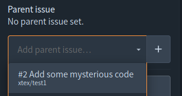
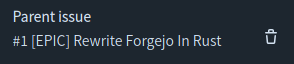
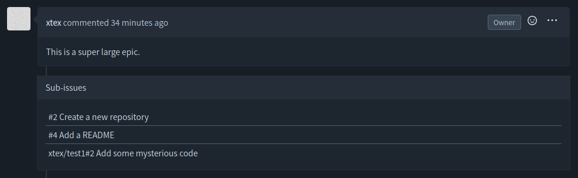

When organizing issues and tasks, it is common to have some large tasks split into small ones. It is possible to set a parent issue so that people can nvigate across issues of a same topic easily.

At the sidebar of a issue, users with write access can see a box to update the parent issue.

Once sub-issues are linked to a parent issue, the list of sub-issue will be shown in the page of parent issue.

Parent-and-sub issues relationship can go across repository, by default. However, you need to have issues write access to the repository of remote parent issues.

There cannot be any circular parent-issue.

The maximum number and depth of sub-issues are limited, by default up to 100 sub-issues (not including the root issue) and 6 layers of sub-issues. Note that the number of sub-issues are counted per root issue. That is, all issues in the same relationship tree as the current issue will be counted.
